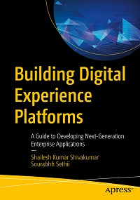

# Apress Source Code

This repository accompanies [*Building Digital Experience Platforms*](http://www.apress.com/9781484243022) by Shailesh Kumar Shivakumar and Sourabhh Sethii (Apress, 2019).

[comment]: #cover

Download the files as a zip using the green button, or clone the repository to your machine using Git.

## Releases

Release v1.0 corresponds to the code in the published book, without corrections or updates.

## Contributions

See the file Contributing.md for more information on how you can contribute to this repository.

## Author's notes

# Building DXP

#### Angular
it contains the front-end application.

#### Integration_Framework
it contains the backend Integration layer.

#### Mocking_Services
ABC Banking API specification folder contains the Swagger API documentation for the application.

	